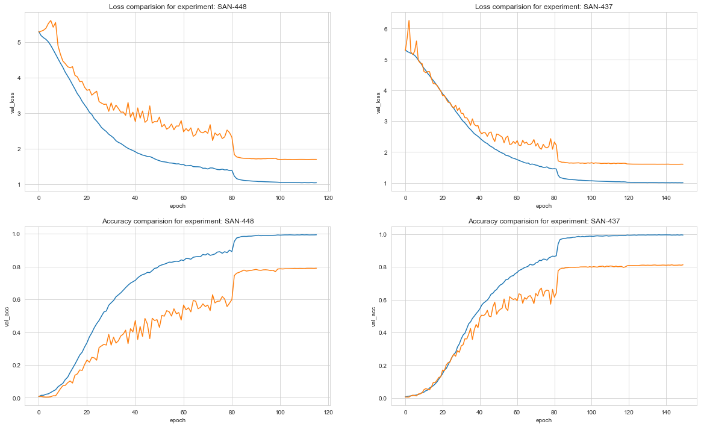

This project is thesis code for my postgraduate studies- Deep neural networks, applications in digital media.

Project implements EfficientNet and it's training on Stanford Cars dataset with possibility of extension to both other models and datasets. My thesis is attached ad part of this readme.

- You can find other networks comparison [here](https://paperswithcode.com/sota/fine-grained-image-classification-on-stanford)
- You can find original implementation in tensorflow [here](https://github.com/tensorflow/tpu/tree/master/models/official/efficientnet).
- Relevant experiments, that I performed can be found on [this neptune dashboard](https://ui.neptune.ai/matkalinowski/sandbox/experiments?viewId=47196815-c2a8-4a2b-bb7c-cf3d146805ac).
- References are in the references.bib file. 


### Howto

This project uses virutalenv as a package manager. To install it automatically use setup.sh script. I was using python 3.8.5.

#### If you are using windows:
- Make sure that python.exe and pip.exe are in the path system variable. 
    - In case of environment variables order matters. If you have multiple python instances make sure that version 3.8.5 is on top.

#### Common part:
- Go to the project root,
- execute: setup.sh
    - if this does not work you can execute commands line by line

# 1. Introduction

Ever since first publications that used deep neural networks began to emerge their sizes grew. Along with the increase in their quality it was possible to build more advanced applications. One interesting branch of deep neural networks is computer vision on mobile devices. Mobile environment is more demanding in terms of computational budget. It caused a lot of research in areas like network scaling or weights shrinking. As it turned out network scaling is not an easy task and it should be approached systematically. Until the publication of the EfficientNet [2] article, there were no comprehensive solutions on this matter. 

Nevertheless there were many ideas how to scale the network:

- ResNet [7] can be scaled up from ResNet-18 to ResNet-200 using **depth**, so calibration was done by adding more layers.
- Gpipe [8] tried scale up models by **image resolution**,
- Zagoruyko and Komodakis in their article Wide residual networks [9] tried to do it using **width scaling**.

EfficientNet article revisits problem and tries to answer the question: "Is there a principled method to scale up ConvNets that can achieve better accuracy and efficiency?" [2]

Mingxing Tan and Quoc V. Le while creating this article showed that this space have a lot of space to improve. They achieved state-of-the-art 84.4% top-1 accuracy on ImageNet while being 8.4 times smaller and 6.1 times faster and showed that this architecture can be successfully used in many transfer learning tasks.

This work will show approaches on applying EfficientNet to Stanford Cars dataset [1].

# 2. EfficientNet architecture

EfficientNet architecture was first proposed in late may 2019 and gained a lot of momentum since then. Authors stated that it is possible to balance all dimensions of the network: depth, width and resolution by a constant ratio. For example if there are  $2^N$ times more computational resources:

- network depth should be increased by $\alpha ^ N$,
- width by $\beta ^ N$,
- image size by $\gamma ^ N$,

where $\alpha, \beta, \gamma$ are constant coefficients determined by a grid search on the baseline model. Authors state that: "The compound scaling method makes sense because
if the input image is bigger, then the network needs more layers to increase the receptive field and more channels to capture more fine-grained patterns on the bigger image."

## 2.1 Baseline network

Effectiveness of this approach relies heavily on the baseline network. Authors have used neural architecture search [4] that achieves even better efficiency than hand-crafted mobile ConvNets by extensively tuning the network width, depth, convolution kernel types and sizes. 

Authors set $$ACC(m) \times [FLOPS(m)/T]^w$$ as optimization goal, where m is model and T is target FLOPS, w value was set to -0.07. W is a parameter to controle tradeoff between accuracy and FLOPS- here they optimize FLOPS rather than latency.

Below is the architecture of the baseline EfficientNet-b0 network.


The main block in the architecture is MBConv block, similar to the inverted residual block from MobileNetV2 [5] architecture. Those blocks form shortcut between the beginning and the end of MBConv. Input activation maps are expanded usinng 1x1 convolutions to increase the depth of the feature maps. This is followed by 3x3 Depth-wise convolutions and Point-wise convolutions that reduce the number of channels in the output feature map. The shortcut connections connect the narrow layers whilst the wider layers are present between the skip connections. This structure helps in decreasing the overall number of operations required as well as the model size. [6]


Diagonally hatched layers do not use non-linearities. They use thickness of each block to indicate its relative number of channels. Note how classical residuals connects the layers with high number of channels, whereas the inverted residuals connect the bottlenecks.

Furthermore authors of MobileNetV2 [5] article say that: "The motivation for inserting shortcuts is similar to that of classical residual connections: we want to improve the ability of a gradient to propagate across multiplier layers. However, the inverted design is considerably more memory efficient (see Section 5 for details), as well as works slightly better in our experiments."

## 2.2 Network scaling

Authors have studied effect of scaling the network using three different dimensions:

- width **(w)**- number of neurons in a layer,
- depth **(d)**- number of layers,
- input image resolution **(r)**.

When looking at those dimensions one can notice that bigger input size can help with accuracy with cost of more FLOPS, width and depth is important when it comes to expressive power of the network but the main difficulty here is to find optimal w, d and r under resource constraints.


*Compound scaling will be explained later.

## 2.3 Dimensions details

- **Width (w)** is commonly used in small models. Intuition behind this scaling is that wider networks tend to be able to capture more fine-grained features and are easier to train. But when network is lacking on depth it can have problems in capturing high level features. Figure 5 shows that width scaling (on the left) quickly comes to a point when further width increasing gives small improvement.
- **Depth (d)** is most common in ConvNet scaling and one of first used. It can capture more complex features and help with generalization. Deeper networks are hard to train due to vanishing gradient problem but it has been proved that skip connections, batch normalization can help with this. There were some ideas to create classifiers not only on the end of the network but also in the middle layers to make sure that those middle layers create usable features. Another problem of this approach that has been spotted when comparing results of ResNet was that accuracy of very deep network diminishes- ResNet-1000 has very similar accuracy to ResNet-101.
- **Resolution (r)** When input image resolution is higher, networks can capture more fine-grained patterns. 


**It is important to note that scaling only one dimension of the network improves accuracy at the beginning but this gain quickly saturate for bigger models.**

Mingxing Tan and Quoc V. Le proposed compound scaling method and it takes the following steps:

- perform a grid search to find the relationship between different scaling dimensions of the baseline network under a fixed resource constraint and save scaling coefficients,
- apply those coefficients to scale the baseline network to desired size / budget.


Above results show that proposed compound scaling can give better accuracy results and have lower FLOPS requirements if done properly.

Authors noticed also that compound scaling can help with having better activation map results- properly scaled network gives more weight to intuitive for humans parts of the image.


Network Scaling coefficients:

| Network version  | width_coefficient | depth_coefficient | resolution |
| ---------------- | ----------------- | ----------------- | ---------- |
| EfficientNets.b0 | 1.0               | 1.0               | 224.0      |
| EfficientNets.b1 | 1.0               | 1.1               | 240.0      |
| EfficientNets.b2 | 1.1               | 1.2               | 260.0      |
| EfficientNets.b3 | 1.2               | 1.4               | 300.0      |
| EfficientNets.b4 | 1.4               | 1.8               | 380.0      |
| EfficientNets.b5 | 1.6               | 2.2               | 456.0      |
| EfficientNets.b6 | 1.8               | 2.6               | 528.0      |
| EfficientNets.b7 | 2.0               | 3.1               | 600.0      |

## 2.4 Performance

EfficientNet performance was calculated on famous ImageNet image database, that can be found here: http://www.image-net.org/. Results in the moment of article publishing was beating every, even more advanced networks in terms of both accuracy and calculations budget.


Below are the exact performance results.


## 2.5 Transfer learning possibilities

Authors have also tested performance of theirs architecture on other datasets and the results are below:


Authors state that "Our scaled EfficientNet models achieve new state-of-the-art accuracy for 5 out of 8 datasets, with 9.6x fewer parameters on average."

The way they trained those models was to take ImageNet pretrained checkpoint and finetune it to new datasets.

It is also worth noticing that authors have reported 93.6% accuracy on Stanford Cars dataset [1] that will be used later in this thesis. Another interesting finding here is that it looks like it has a lot of transfer learning potential.

# 3. Dataset description

In this work Stanford Cars dataset [1] was used. It is available under this link: https://ai.stanford.edu/~jkrause/cars/car_dataset.html.

The Cars dataset contains 16,185 images of 196 classes of cars. The data is split into 8,144 training images and 8,041 testing images, where each class has been split roughly in a 50-50 split. Classes are typically at the level of Make, Model, Year, e.g. 2012 Tesla Model S or 2012 BMW M3 coupe.

Example images from this dataset can be found on figure 12.


Stanford dataset has one visible outlier, which is class 118- GMC Savana Van 2012. It has 136 images where rest of the cars have below 100. Figure 13 shows distribution of counts for different classes.


# 4. Tools description

Below are main tools were used to complete this project:

- Python 3.8.5
  - Pytorch as a deep learning library,
  - Pytorch-lightning as a Pytorch code organizer.
- Neptune as a experiment tracking tool.
- Git as a version control tool.

Specific requirements with their versions can be found here:

https://github.com/matkalinowski/dnn/blob/master/requirements.txt

## 4.1 Tools summary

**Pytorch** is a great library for deep learning models development and it is very easy to get started as well as prototype. It enables easy models debugging and clean API. **Pytorch-lightning** introduces modules that help organize code and I also definitely recommend it.

When in comes to **Neptune** this tool needs some work, but still is a very good tool for experiments tracking. Every experiment has its artifacts- model and predictions on training and validation dataset saved in artifacts page.


Neptune pros:

- Enables sharing specific view of experimentation dashboard and easy experiments comparison.
- It is free up to 100GB of space.  
- Provides API to download experiments results.

Neptune cons:

- Does not provide way to customize colors and default ones are not the best.
- No easy way to download results from UI perspective.  
- It crashes once a while, it results with error in the experiment which can be very frustrating.

# 5. Experiments description

Whole code required to run this experiments as long as network implementation can be found here: https://github.com/matkalinowski/dnn.

Every relevant experiment is publicly available and can be found under this link: https://ui.neptune.ai/matkalinowski/sandbox/experiments?viewId=47196815-c2a8-4a2b-bb7c-cf3d146805ac. Please note that viewId on the end of this link gives you access to a specific view of the results table, that I recommend.

Important notes:

- I have used other than original pretrained weights, direct links can be found here: https://github.com/matkalinowski/dnn/blob/master/models/efficient_net/efficient_nets.py.
- I changed last layer of the network to take into account number of classes in the dataset.
- I focused mainly on b0 network due to computational resources constraints.

## 5.1 Working environment

I used 3 environments: colab, local, azure cloud, but the results that I will be comparing will be from later two. I used requirements file to install required packages on every environment. Every training was run using perform_training function from train.py file in training package, this helped me to easily track every run settings because the training file is uploaded to Neptune with git hash.

## 5.2 Loss function

Loss function I used to all described experiments is LabelSmoothingCrossEntropy. This function is very useful when working with multiclass classification problems like the one presented in the Stanford Cars dataset. Label smoothing changes the target vector by a small amount `e`. **Thus, instead of asking our model to predict** `**1**` **for the right class, we ask it to predict** `**1-e**` **for the correct class and** `**e**` **for all the others.** So, the cross-entropy loss function with label smoothing is transformed into the formula below.[9]


Where ce(i) is standard cross-entropy loss, N is number of classes. This loss function have a regularization influence and intuitively restraints value for the correct class to be closer to values for other classes, thus preventing overfitting.

```python
def reduce_loss(loss, reduction='mean'):
    return loss.mean() if reduction == 'mean' else loss.sum() if reduction == 'sum' else loss


def linear_combination(x, y, epsilon):
    return epsilon * x + (1 - epsilon) * y


class LabelSmoothingCrossEntropy(nn.Module):
    def __init__(self, epsilon: float = 0.1, reduction='mean'):
        super().__init__()
        self.epsilon = epsilon
        self.reduction = reduction

    def forward(self, preds, target):
        n = preds.size()[-1]
        log_preds = F.log_softmax(preds, dim=-1)
        loss = reduce_loss(-log_preds.sum(dim=-1), self.reduction)
        nll = F.nll_loss(log_preds, target, reduction=self.reduction)
        return linear_combination(loss / n, nll, self.epsilon)
```

## 5.3 Data preprocessing

I have used transforms from the torchvision library, here is a list of transformations applied to training dataset:

```python
transform_ops = [
    transforms.Resize((self.image_size, self.image_size)),
    transforms.RandomHorizontalFlip(),
    transforms.RandomAffine(25, translate=(0.1, 0.1), scale=(0.9, 1.1), shear=8),
    transforms.ToTensor(),
    transforms.ColorJitter(),
]
# Here are transformations applied to validation set:
transform_ops = [
    transforms.Resize((self.image_size, self.image_size)),
    transforms.ToTensor(),
]
# Additionally normalization was applied. Depending on set number of channels here is normalization for 3 channel input:
transforms.Normalize(mean=[0.470, 0.460, 0.455], std=[0.267, 0.266, 0.270])

# And here are additional transformations for single channel, please note the grayscale transformation at the beginning:
transforms.Grayscale(), *transform_ops, transforms.Normalize(
    mean=[0.462],
    std=[0.270]
)
```


Transformations operations description:

- **Resize**
  - Resize transformation is needed because every EfficientNet architecture has its own resolution needed to work well. For B0 version it is 224x224.
- **RandomHorizontalFlip**
  - This transform performs horizontal flip of the image, default probability of flip is 0.5.
- **RandomAffine**
  - Is a transformation to keep network center invariant. It will rotate and rescale the image. 
- **ColorJitter**
  - It will randomly change the brightness, contrast and saturation of an image.
- **Normalization**
  - It will normalize the image using values calculated on the training dataset by substracting the mean and dividing by standard deviation.

## 5.4 Training ideas

At the beginning of the training I was trying to maximize the accuracy on validation dataset and it was a pretty easy task when there is a pretrained network around. I managed to get 91.4% accuracy on validation dataset using b0 network, higher than this reported in original paper (look experiment SAN-319) but couldn't reproduce this score later (look experiment SAN-474) and got only 90.7%. Results presented below are from a grid search performed on EfficientNet-B0 network.

Then I tried to maximize this result using 1 or 3 channels and trying to regularize the network more using weight_decay of AdamW optimizer, but those results were still the best I got. 

This network had:

- 4258048 FLOPS on single channel,
- 4258624 on 3 channel.

Concurrently I ran experiments trying to achieve similar results without using pretrained weights, but this was a harder task and I achieved maximum accuracy of 81.2% using network with single channel.

Because in every case training loss was diverging from the validation one I tried to increase the regularization- weight decay in AdamW and dropout rate in the network itself.

## 5.5 Training script

```python
import sys
from typing import Optional, List

sys.path.append('.')

import pytorch_lightning as pl
import torch
from pytorch_lightning.callbacks import ModelCheckpoint, LearningRateLogger
from pytorch_lightning.loggers import NeptuneLogger

from datasets.stanford.stanford_cars_data_module import StanfordCarsDataModule
from models.efficient_net.efficient_net import EfficientNet
from models.efficient_net.efficient_nets import EfficientNets
from training.cars_dataset_callback import StanfordCarsDatasetCallback
from training.trial_info import TrialInfo
from utils.default_logging import configure_default_logging

log = configure_default_logging(__name__)

def perform_training(
        trial_info: TrialInfo,
        training_data=None,
        model=None,
        logger_tags: Optional[List[str]] = None,

):
    if model is None:
        model = EfficientNet(trial_info=trial_info)
    if training_data is None:
        training_data = StanfordCarsDataModule(batch_size=trial_info.batch_size,
                                               in_channels=trial_info.in_channels,
                                               image_size=model.image_size)

    neptune_logger = NeptuneLogger(
        project_name="matkalinowski/sandbox",
        experiment_name=f"{str(trial_info)}",
        tags=logger_tags
    )

    early_stop_callback = pl.callbacks.early_stopping.EarlyStopping(
        min_delta=1e-3,
        patience=10
    )

    checkpoint_callback = ModelCheckpoint(filepath=str(trial_info.output_folder))

    callback = StanfordCarsDatasetCallback(trial_info)
    lrl = LearningRateLogger()

    trainer = pl.Trainer(max_epochs=trial_info.epochs,
                         gpus=1,
                         # fast_dev_run=True,
                         logger=neptune_logger,
                         callbacks=[callback, lrl],
                         checkpoint_callback=checkpoint_callback,
                         early_stop_callback=early_stop_callback
                         )
    trainer.fit(model, datamodule=training_data)
    
if __name__ == '__main__':
    trial_info = TrialInfo(model_info=EfficientNets.b0.value,
                           load_weights=True,
                           advprop=False,
                           freeze_pretrained_weights=False,
                           epochs=150,
                           batch_size=32,
                           initial_lr=1e-3,
                           optimizer=torch.optim.AdamW,
                           optimizer_settings=dict(),
                           scheduler_settings=dict(patience=3),
                           custom_dropout_rate=None,
                           num_classes=196,
                           in_channels=3,
                           )
    perform_training(trial_info)

```

Perform_training method contains:

- initialization of neptune logger,
- callback to stop training when no better results are achieved,
- callback to store best model in created folder,
- custom callback to send additional information to neptune,
- initialization of learning rate logger- to be able to better see then learning rate was decreased,
- setting Pytorch-lightning Trainer,
- fitting of the model

Next main if statement is visible to be able to run this file from command line with Trial info initialization.

Trial info is a dataclass containing every information that changes with given training iteration. it has post init method to create folder to stare output data and uuid to easily identify the results.

```python
@dataclass
class TrialInfo:
    model_info: EfficientNets

    load_weights: bool
    advprop: bool
    freeze_pretrained_weights: bool

    epochs: int
    batch_size: int
    initial_lr: float
    optimizer: Optimizer
    optimizer_settings: Dict
    scheduler_settings: Dict
    custom_dropout_rate: Optional[float]

    num_classes: int
    in_channels: int

    def __post_init__(self):
        self.trial_id = uuid1()
        date_folder = create_date_folder(get_project_structure()['training_trials'])

        self.output_folder = date_folder / str(self.trial_id)
        mkdir_if_not_exists(self.output_folder)

```

## 5.6 Learning rate scheduling

Learing rate scheduling is a useful tool and it helped me gaining better results. It is visible that decreasing learning rate improves both loss and accuracy.

I used ReduceLROnPlateau scheduler with 

- factor set to 0.1- it means that everytime it runs it will multiply current learning rate by 0.1. 
- Patience, so the value responsible for counting how many epochs have passed without improvement, value was changing, I picked two values based on previous experiments 3 and 7.
- Threshold- if difference between previous loss was higher than this value patience value is zeroed. Set to 1e-3.


# 6. Experiments results

## 6.1 Pretrained network results

Pretrained networks gave the best results, about 10 pp. higher than those trained from scratch. They achieve 80% accuracy before 10'th epoch which was very suprising. They work for wide range of hyperparameters and require only proper data augmentation to work on this level of accuracy.


```
# Pretrained network results

max_val_acc:0.9031956791877748
max_train_acc:0.9985294342041016
optimizer:<class 'torch.optim.adamw.AdamW'>
initial_lr:0.001
in_channels:3.0
load_weights:1.0
custom_dropout_rate:0.0
name:efficientnet-b0-82409404-fab3-11ea-bd84-2988f320ae9d
optimizer_settings__weight_decay:0.01
scheduler_settings__patience:3
scheduler_settings__factor:nan
```

### 6.1.1 Regularization and its performance influence on models with pretrained weights

Changing values for dropout rate, weight decay had almost no influence on validation and training accuracy.


### 6.1.2 Regularization and its performance influence on all the experiments

When it comes to regularization in perspective of all experiments we can see that dropout rate has effect on average accuracy. Higher the value equals lower overall performance. The same story goes with weight decay


In this moment I have also tried freezing values of convolutional layers, but results showed that this approach won't be a good idea in this dataset probably because of large number of classes and high similarities between them.


## 6.2 Training from scratch results

Due to obtaining satisfaction results in terms of accuracy

### 6.2.1 RGB channel training results

When training from scratch RGB training required more work and it was more time consuming without giving better results.


```
# RGB channel training from scratch results

max_val_acc:0.7897878289222717
max_train_acc:0.9938725233078004
optimizer:<class 'torch.optim.adamw.AdamW'>
initial_lr:0.001
in_channels:3.0
load_weights:0.0
custom_dropout_rate:0.2
name:efficientnet-b0-2c7a42a8-fe6a-11ea-ad12-ab3860b636f8
optimizer_settings__weight_decay:0.3
scheduler_settings__patience:7
scheduler_settings__factor:nan
```

Dropout rate had significant influence on the accuracy. Weight decay with default value of 0.01 was not the best choice, values in range 0.2-0.3 yield better results.


### 6.2.2 Grayscale training results

Grayscale images showed better results and were easier to train, they worked for wide range dropout values as well as weight decay values. 


```
# Grayscale channel training from scratch results

max_val_acc:0.8126240372657776
max_train_acc:0.9962009787559508
optimizer:<class 'torch.optim.adamw.AdamW'>
initial_lr:0.001
in_channels:1.0
load_weights:0.0
custom_dropout_rate:0.0
name:efficientnet-b0-7d67d4b1-fd8c-11ea-8bbb-001a7dda7112
optimizer_settings__weight_decay:0.1
scheduler_settings__patience:7
scheduler_settings__factor:nan
```


### 6.2.3 RGB and grayscale comparision

Best models both in grayscale as well as in RGB scale achieve similar loss and accuracy results. Images below shows that they even trigger learning rate decrease in almost the same moment. Grayscale network holds validation loss closer to the training one at the beginning of the training.

Pretrained weights helped with obtaining better results and loss decay in this type of training is more smooth.




## 6.3. Predictions analysis

Last image shows predictions for every analyzed model. X-axis shows different models and y-axis shows index of validation dataset example. Black color means that model made a mistake. There are visible grids with different settings. First rows shows pretrained networks and latter ones show increasing of regularization and decreasing performance. Image contains horizontal lines which indicate that there are some hard examples in the dataset- multiple different models make mistake on theirs prediction. The hardest class was number 183, Suzuki SX4 Sedan 2012, it have 5 images that wasn't predicted well by any of my classifier.


# 8.  Conclusions

EfficientNet can be easily applied to transfer learning classification tasks and even the default configuration can be useful and yield good results. Results show almost state of the art accuracy on Stanford Cars dataset giving possibility to achieve even better results when using more complex version of EfficientNets. Implementation has its drawbacks because of generative approach to network creation. Compound scaling shows good results and to my current knowledge there are no other approaches that surpass this proposal.

# 9. Extras
- [lukemelas implementation](https://github.com/lukemelas/EfficientNet-PyTorch), this repository serves also as a source of pretrained network parameters.
- My colleague implementation of other architectures and his results on the same dataset can be found [here](https://github.com/pchaberski/cars). Please note great approach to network configuration.
