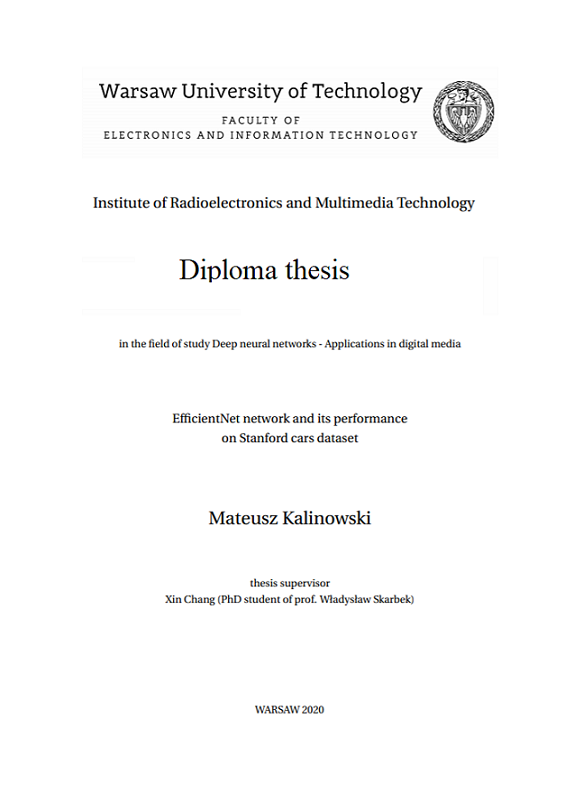

  
 

# EfficientNet network and its performance on Stanford cars dataset

**Abstract.** This work revisits EfficientNet architecture and describes approach to scaling the neural networks. Then applies is to the Stanford Cars dataset containing 196 different car classes. It was possible to obtain 91.4% of accuracy on validation dataset which is close to what Authors of EfficientNet article reported in their findings.

**Keywords**: EfficientNet, mobile networks, Convolutional networks, network scaling, 

  
